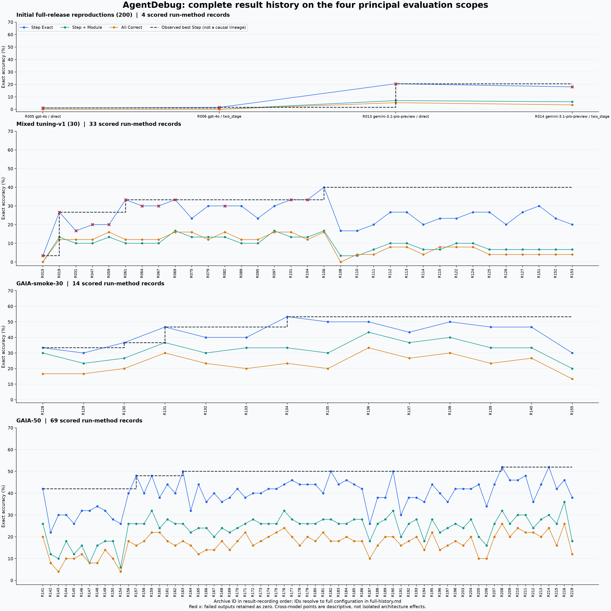
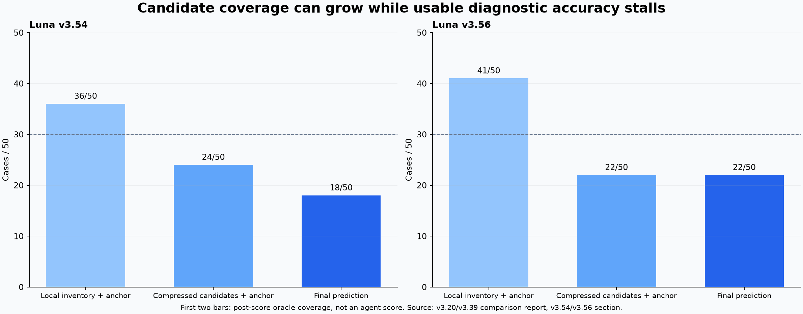

# 从首次复现到 SDK 移植：完整实验记录与结果规律

2026-09-06 起，所有结果按 [LLM API / Codex SDK 方法族](../method-family-policy.md) 报告。
历史宿主 Codex agent/subagent 均计入 SDK 方法族；实际后端和冻结实验名称保留。
[各精确测试集的次数](../method-family-counts.md) 不因分类合并而增加总实验数。
本目录是截至 2026-09-05 的已审阅快照；重建中发现的后续产物列在
[待审阅增量](post-archive-inventory.json)，不静默纳入本次计数或重编号旧实验。

这份档案从本地最早保存的 **2026-07-23 GPT-4o 官方式复现**开始，覆盖到 **2026-09-03 GPT-5.5 Official SDK v3** 的已评分结果。7 月的实现是本地官方式两阶段复现；8 月 19 日的 GPT-4.1 public-repo topology 才是后来逐项对齐公开仓库调用拓扑的 GAIA-50 实验，两者不能混称同一个 baseline。

恢复范围是当前工作区保存的产物，不包含已经删除或只存在于其他机器的运行。8 个记录没有可确认的结构化时间戳，明确留空。没有使用文件修改时间猜测实验日期，也没有重新调用模型。

## 完整交付

- [按时间逐次排列的227行结果与配置总表](chronological-table.md)：从首次复现开始逐行阅读。
- [全部 227 条结果、每条配置及原始证据](full-history.md)：包括此前摘要省略的全部已保存评分版本，失败和受限记录也保留。
- [全部结果 CSV](all-results.csv) / [JSON](all-results.json)：可检索、排序；保留模型、各阶段模型/effort、temperature、并发、重试、token cap、timeout、拓扑、父版本、数据身份和证据路径。
- [零失败且无已记录否决的 171 条结果](complete-valid-results.csv)：这是计分记录数，不等于 171 次相互独立的全流程 fresh 实验；阶段重放另有字段说明。
- [按各时期计分规则可纳入的 214 条结果](eligible-results.csv)：包含 43 条“失败输出按零分保留在固定分母”的早期合法计分。
- [64 个无正式分数的计划/执行目录](unscored-inventory.csv)：不将未完成输出补算成正式结果。
- [核验统计](verification-summary.json)：227/227 条记录的三项正确数、样本数和 All Correct 分母与逐例 CSV 相符。

222 份 metrics 展开成 227 条“运行×方法”记录，是因为部分早期运行同时评估 direct 和 two_stage。另有一个旧 GAIA-50 与新 rest150 的合并报告，标为 `composed_report`，不算新增 200 条推理。

## 必须纠正的历史口径

早期实验并非都在 GAIA-50：先有三环境混合的全 200、tuning30、smoke30 和 dry3/dry5，随后有 GAIA-smoke30、GAIA-50，以及基于历史错例选取的 hard8/structural10。分母相同也不能自动认为样本相同；JSON/CSV 保存了逐例集合指纹。

“有分数”“零失败”“满足后来采用的实验边界”是不同的概念。本次单列了以下记录：

| 类型 | 记录数 | 处理 |
|---|---:|---|
| 零失败、没有发现已记录的独立否决 | 171 | 纳入结果表；是否阶段重放另列 |
| 完整分母计分、部分输出失败 | 43 | 按历史规则计分；明确失败数，不冒充全量输出合法 |
| Luna v7–v12 使用历史同case预测 | 6 | 保留历史分数，不纳入后续 no-prior 边界下的合规曲线 |
| v3.61、v3.62、v3.64、v3.65 独立访问/写入审计失败 | 4 | 保留原分数，排除合规曲线 |
| Luna v12 standalone 存在独立审计缺口 | 1 | 限定使用 |
| GPT-4.1 boundary-v5 hard8 运行中改 validator | 1 | 仅开发诊断 |
| GAIA50 + rest150 合并报告 | 1 | 展示覆盖情况，不算独立200条运行 |

因此，之前将 v3.61 等版本仅描述为“完整合法但分数低”是不充分的，必须补充独立审计否决。

三个早期 GAIA-50 对照也明确复用了冻结的历史中间结果：Sol→Luna serial-v2、Luna→Sol causal-serial-v1、GPT-5.5 official-phase2-v1。它们的计分可以核验，但不是从头重新产生所有阶段的 fresh 运行。配置表已还原继承阶段及各阶段模型。

## v3.4 之前到底有哪些进展

下面专门摘出此前最容易遗漏的早期结果；完整档案还逐条列出了全部 dry screen、后续版本和各次对照。

### 首次全量官方式复现与混合30调优

| 版本 / 方法 | 数据 | 模型配置 | Step | Step+Module | All | 失败数 |
|---|---|---|---:|---:|---:|---:|
| 首次 full-release direct | 全200 | GPT-4o，T=0 | 2/200 | 0/200 | 0/170 | 177 |
| 首次 full-release two_stage | 全200 | GPT-4o，T=0 | 3/200 | 0/200 | 0/170 | 185 |
| Gemini direct | 全200 | Gemini-3.1-pro-preview，T=0 | 41/200 | 14/200 | 9/170 | 42 |
| Gemini two_stage | 全200 | Gemini-3.1-pro-preview，T=0 | 36/200 | 12/200 | 6/170 | 67 |
| GPT-4.1 baseline | tuning30 | GPT-4.1，T=0 | 1/30 | 0/30 | 0/25 | 10 |
| E1-v7 | tuning30 | GPT-4.1，T=0 | 8/30 | 4/30 | 3/25 | 1 |
| E6-v2 | tuning30 | GPT-4.1，T=0 | 5/30 | 3/30 | 3/25 | 4 |
| E9-v13 | tuning30 | GPT-4.1，T=0 | 6/30 | 3/30 | 3/25 | 1 |
| E9-v25 | tuning30 | DeepSeek-v4-flash，T=0 | 10/30 | 3/30 | 3/25 | 2 |
| E9-v30 | tuning30 | DeepSeek-v4-flash，T=0 | 10/30 | 5/30 | 4/25 | 1 |
| E9-v58 | tuning30 | DeepSeek-v4-flash，T=0 | 12/30 | 5/30 | 4/25 | 0 |
| E9-v58 fresh | smoke30 | DeepSeek-v4-flash，T=0 | 8/30 | 3/30 | 3/27 | 3 |
| Luna v1 | tuning30 | Luna，medium | 5/30 | 1/30 | 1/25 | 0 |
| Luna v2 | tuning30 | Luna，medium | 6/30 | 2/30 | 1/25 | 0 |
| Luna v3 | tuning30 | Luna，medium | 8/30 | 3/30 | 2/25 | 0 |
| Luna v4 | tuning30 | Luna，medium | 8/30 | 3/30 | 2/25 | 0 |
| Luna v5 | tuning30 | Luna，medium | 6/30 | 2/30 | 1/25 | 0 |
| Luna v6 | tuning30 | Luna，medium | 7/30 | 2/30 | 2/25 | 0 |
| clean-debate v1 | tuning30 | Luna，medium | 8/30 | 3/30 | 2/25 | 0 |
| clean-debate v2 | tuning30 | Luna，medium | 8/30 | 2/30 | 1/25 | 0 |
| clean-debate v3 | tuning30 | Luna，medium | 6/30 | 2/30 | 1/25 | 0 |
| clean-debate v4 rerun1 | tuning30 | Luna，medium | 8/30 | 2/30 | 1/25 | 0 |

这是阅读导引，绝非用代表版本代替全量清单；其余 E9 full30、全部 dry3 和 routed/standalone 等记录都在 [完整结果表](full-history.md)。

### GAIA-smoke30 的完整已评分序列

这些版本统一使用 Luna / medium，通常每case一个fresh session、并发4、最多2次尝试。准确配置以每条运行的计划文件为准。

| 版本 | 核心机制 | Step | Step+Module | All |
|---|---|---:|---:|---:|
| GAIA v1 | 修复嵌套证据的owner划分 | 10/30 | 9/30 | 5/30 |
| v2.1 | recovery-aware状态ledger；修复执行路径 | 9/30 | 7/30 | 5/30 |
| v3 | 按时间和lane扫描，先冻结Step | 11/30 | 8/30 | 6/30 |
| v3.1 | 外部异常packet边界 | 14/30 | 11/30 | 9/30 |
| v3.2 | capability admission gate | 12/30 | 9/30 | 7/30 |
| v3.3 | strategy identity gate | 12/30 | 10/30 | 6/30 |
| v3.4 | 可验证的候选ledger与checkpoint | 16/30 | 10/30 | 7/30 |
| v3.5.1 | 后续候选机制与执行修复 | 15/30 | 9/30 | 6/30 |
| v3.6 | taxonomy/owner相关优化 | 15/30 | 13/30 | 10/30 |
| v3.7.1 | 后续机制及合同修复 | 13/30 | 11/30 | 8/30 |
| v3.8 | 后续边界机制 | 15/30 | 12/30 | 9/30 |
| v3.9 | 后续边界机制 | 14/30 | 10/30 | 7/30 |
| v3.10 | 后续边界机制 | 14/30 | 10/30 | 8/30 |
| v3.12-global | 全局选择 | 9/30 | 6/30 | 4/30 |

v3.4 随后在 GAIA-50 上是 21/50、13/50、10/50。不能把 smoke30 的16/30和paper50的21/50当成同分布上的升降。

## 图像和结果规律

### 四个主要数据范围的全部可纳入计分



蓝线为Step，绿线为Step+Module，橙线为All，黑色虚线是该面板的历史最好Step；红叉表示该次报告包含按零分计入的失败输出。横轴R编号在完整结果表中对应每次运行。黑线包含模型/配置变化，仅是描述性历史上界，不是架构变化的因果效果。

1. **早期的低分首先伴随大量执行/证据失败。** GPT-4o两阶段全200里185条失败，不能解释成“模型诊断能力只有1.5%”。随后API调优显著降低无效输出，但完整诊断准确率仍低。
2. **简单有效的约束带来最明显的早期收益。** GAIA30 从 v1 的10/30，经 v3/v3.1 到 v3.4 的16/30。加入更多gate并不保证进步，v3.2/v3.3都回落到12/30。
3. **GAIA50 的平台期可以量化。** v3.20之后、v3.83模型替换之前，共39条可纳入比较的后续完整GAIA50记录；Step范围13–25/50，中位数21/50，只有v3.39和v3.49打平25/50，没有超过。独立审计失败的四条不计入这39条。
4. **提高Step与提高完整三元组不是同一个目标。** GAIA30的v3.4是16/30 Step、7/30 All，v3.6是15/30 Step、10/30 All。GAIA50的v3.14是24/50 Step、8/50 All，v3.16保持24/50 Step但All达到11/50。历史Step-only接受规则会拒绝有其他指标收益的版本。
5. **模型替换和架构收益应分开。** v3.20 Luna 25/50→v3.83 GPT-5.5 26/50是模型替换的一次观测，不是新增架构收益。high effort版本只有23/50；更多推理预算没有在这次实验中带来收益。
6. **SDK 方法族同时覆盖宿主架构搜索与 app-server 移植。** 上述 Luna 与 GPT-5.5 宿主实验也归入该方法族。app-server 子类中，v3.107继承v3.83语义，23/50 Step、18/50 Step+Module、13/50 All；Official SDK v3则是19/50、9/50、6/50。后者运行更晚，不能写成先从官方19提升到优化23的真实连续迭代。
7. **公开样本上的平台与重跑波动并存。** 这些多数是同一公开集合上的单次fresh运行；历史最好成绩只是观测最好值。39次未超过是难度证据，但不证明理论饱和，也不能证明25→26具有统计稳定性或隐藏集泛化。

### GAIA-50 每个版本的完整三指标

[69行逐版本图 PNG](02-gaia50-every-version.png) / [PDF](02-gaia50-every-version.pdf)。每一行对应一个可纳入计分的GAIA50版本；不会只画被接受的版本。

### 所有小样本诊断和其他范围

[全部小样本/独立范围 PNG](03-diagnostics-and-other-scopes.png) / [PDF](03-diagnostics-and-other-scopes.pdf)。样本集合不同，因此使用散点，不把不同dry/gate结果连成一条学习曲线。1例或3例的100%不代表任务饱和。

### 候选覆盖没有充分转化成准确率



图中前两根柱是评分后的候选集合覆盖上限，只有最后一根是实际模型分数。v3.54从36/50候选覆盖，经压缩降到24/50，最终18/50；v3.56从41/50覆盖，经压缩只剩22/50，最终22/50。原始依据是 [候选与选择分析](../../experiments/luna-gaia-v3p20-v3p39-vs-paper-agentdebug-comparison-2026-08-25.md)，v3.54/v3.56小节。

这个规律与“继续增加专家或候选数量即可提高成绩”的假设不符：一部分瓶颈在正确候选被过滤、压缩或仲裁丢弃，另一些版本则因为过度override造成净回归。不能将评分后oracle拿来作SOTA或可实现的算法分数。

## 重建方式

运行仓库中的 [重建脚本](../../../scripts/reconstruct_experiment_history.py)：

```bash
uv run --no-project --with matplotlib python scripts/reconstruct_experiment_history.py
```

脚本只读取原始输出，写入本档案目录；`uv --no-project`的绘图依赖不改项目锁文件。三项指标均从原始metrics提取并用per-example正确标志与分母重算核对。没有重跑历史模型，也没有将未评分部分运行事后补算成正式实验。
