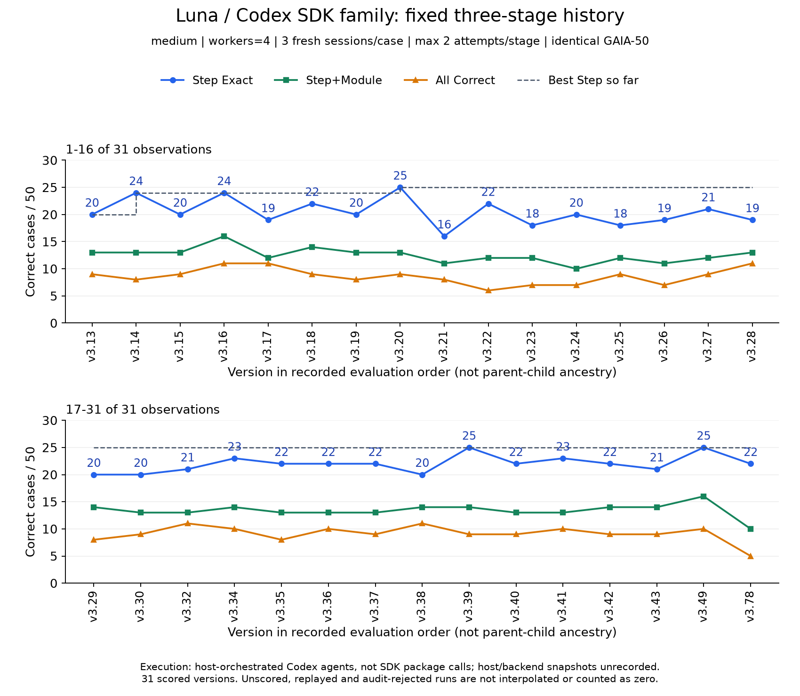
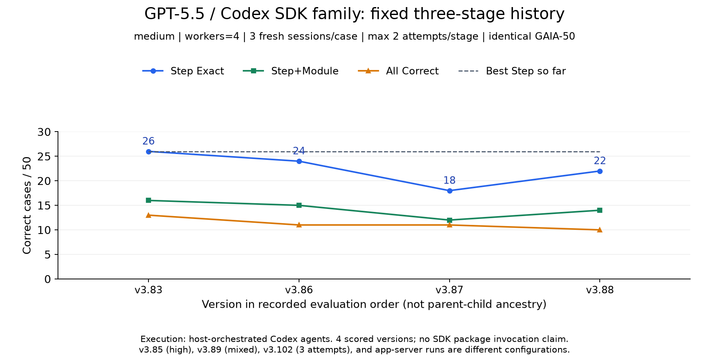
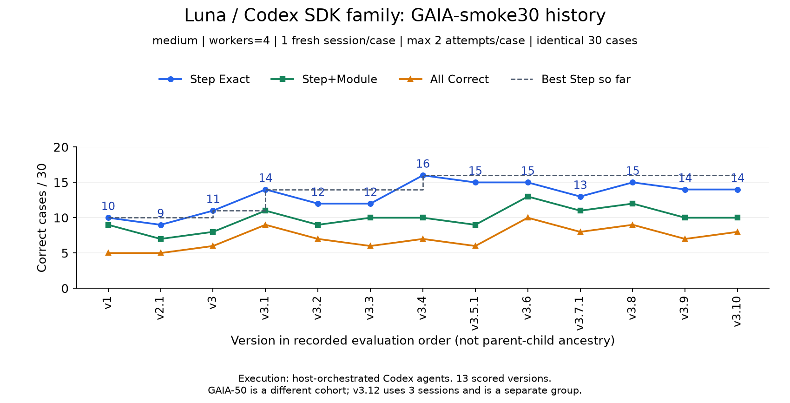
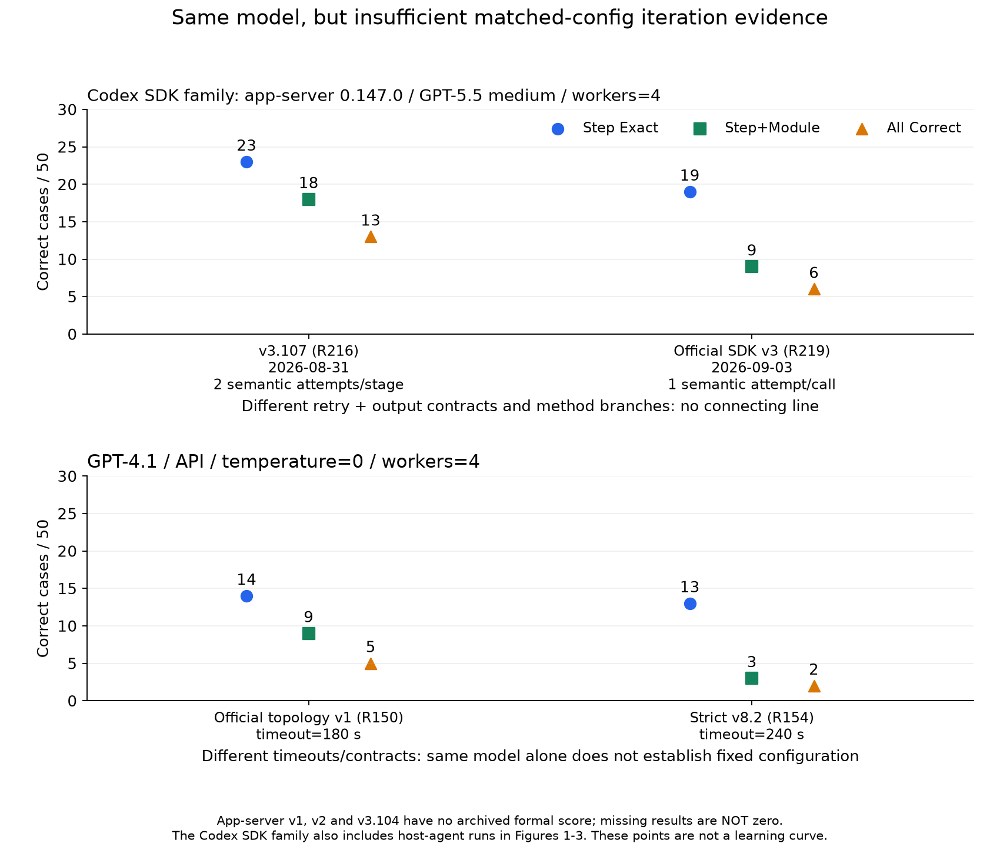

# 固定已记录实验配置下的版本演变

本报告采用 [统一方法族口径](../method-family-policy.md)：历史 Codex agent/subagent
与 SDK/app-server 都归入 **Codex SDK 方法族**。图像与导出表已更新家族标注，
但严格配置组仍按实际后端分开；归类不会把未知运行条件变成已匹配条件。

这组图回答的是：**同一数据、执行方式、模型、effort、并发和重试配置下，改动方法版本后结果如何变化？**
它替代跨模型/跨执行方式总图作为架构迭代的观察入口，但不修改或删除原来的历史档案。

本次覆盖完整档案中的 GAIA-50 73 条记录，以及 GAIA-smoke30 14 条记录，共 87 条，
分为 32 个配置组；每条都有去向，包括不能进入主曲线的版本。其他数据范围仍见
[原始 227 条档案](../experiment-history-2026-09-05/README.md)，没有混入这组 GAIA 曲线。

## 怎样理解“固定”

主曲线同时锁定：

- AgentErrorBench 数据身份、逐例集合 SHA-256、三项指标的分母；不是只看同样写着“50”。
- Codex SDK 方法族内的宿主 agent/subagent 与 SDK/app-server 后端分开；已记录版本也必须一致。
- 所有阶段的模型与 reasoning effort；混合模型不按顶层 model 标签并入单模型组。
- 并发、语义尝试上限及作用范围、已记录的 transport 重试、temperature、token cap、timeout。
- 每例计划 fresh session 数、每 session 案例数、跨 case 状态边界，以及 fresh/replay 身份。

方法内部的提示、候选/选择/仲裁机制是允许变化的研究变量。provider 按此前约定不作为
分组过滤条件。导入预测后评分元数据中的 `max_retries` 不当作 agent 推理重试参数；
agent 组使用原计划的 `session_topology.max_attempts_per_stage/case`。

**这是“已记录配置匹配”，不是完全受控的因果实验。** 早期 Codex agent 宿主版本、
模型 backend snapshot、若干默认值没有记录，不能由 `null` 推断它们真的相同。
同样的三阶段和重试上限也不等于相同 token、耗时或实际调用次数。
连线仅表示已保存评测的先后，不表示每个版本都继承前一个版本；很多候选回到同一 incumbent 改造。

纵轴是正确案例数；蓝色为 Step Exact，绿色为 Step+Module，橙色为 All Correct，
虚线只累计**本配置组**的历史最好 Step，不借用其他模型或预算的成绩。
横轴顺序依据档案的结构化记录时间；对导入预测的记录，这是评分时间，不冒充推理开始时间。

## 1. Luna / medium / Codex SDK 方法族：宿主后端，固定三阶段，GAIA-50

固定：`gpt-5.6-luna`、`medium`、并发 4、每例 3 个 fresh session、每阶段最多尝试 2 次，
同一 GAIA-50、无历史预测重用。共 **31 个完整计分版本**。



Step 最好值从 v3.13 的 20/50，经 v3.14 的 24/50，到 v3.20 的 25/50。
此后本配置组还有 23 次已评分候选，Step 在 16–25/50，只有 v3.39 和 v3.49 打平 25/50，
没有超过。最新纳入的 v3.78 为 22/50。原图中 GPT-5.5 的 26/50 不属于这条曲线。

完整 [PDF](01-luna-gaia50-fixed-three-stage.pdf)。

## 2. GPT-5.5 / medium / Codex SDK 方法族：宿主后端，固定三阶段，GAIA-50

固定配置同上，模型换为 `gpt-5.5`；这是独立曲线，不与 Luna 连线。



Step 序列为 v3.83 **26** → v3.86 **24** → v3.87 **18** → v3.88 **22**，分母都是 50。
这几次方法改动没有超过本组起点。

没有混入 v3.85（high effort）、v3.89（GPT-5.5 + Sol 混合模型）、v3.102
（每阶段三次尝试、两阶段），也没有把 v3.107 的 SDK 运行当作同一执行配置的后继。

完整 [PDF](02-gpt55-gaia50-fixed-three-stage.pdf)。

## 3. 更早的 Luna / medium / Codex SDK 方法族：宿主后端，固定单 session，GAIA-smoke30

固定：并发 4、每例一个 fresh session、每 case 最多尝试 2 次，同一 GAIA-smoke30。



共 13 个版本。Step 最好值从 10/30 升到 v3.4 的 16/30，此后未超过；v3.6 虽然
Step 为 15/30，但 Step+Module 为 13/30、All 为 10/30，说明三个指标并不同步。
v3.12-global 改为三阶段，因此不接在这条固定单 session 曲线后面。

完整 [PDF](03-luna-gaia30-fixed-case-session.pdf)。

## 4. SDK 方法族的 app-server 子类和 GPT-4.1 API：非同配置对照



两个完整 app-server 结果虽然同为 `gpt-5.5 / medium / openai-codex 0.147.0 / 并发4 / GAIA-50`，
但语义重试、内部调用拓扑和输出合同不同：

| 历史记录 | 时间（档案评分时间） | Step / Step+Module / All | 重要不同 |
|---|---|---|---|
| R216，v3.107 | 2026-08-31 | 23 / 18 / 13 | v3.83 三阶段语义；每阶段最多2次语义尝试；严格 owner/taxonomy 校验 |
| R219，Official SDK v3 | 2026-09-03 | 19 / 9 / 6 | 官方逐 step×module 调用；不做语义重采样；native taxonomy + others bridge |

v3.107 的 provider request 重试为最多 2 次重试（含初次最多 3 次请求），stream 最多恢复 2 次；
Official SDK v3 的同提示外层 transport 最多尝试 3 次，内部 provider 重试不可观测。
这不能简化成同一套“重试2/3”的参数。

所以这里画独立点，不把它们写成“官方19 → 优化23”的真实历史优化曲线。
Official SDK v1、v2、v3.104 没有归档正式分数，不补成 0，也不拿部分案例拼接。
依据见 [SDK 运行参数摘录及原文件哈希](sdk-runtime-evidence.json) 和
[无正式分数的目录清单](../experiment-history-2026-09-05/unscored-inventory.csv)。

GPT-4.1 API 的 R150 与 R154 也分别用了 180 秒和 240 秒 timeout，并有不同协议合同，
不能仅凭模型相同就画成严格固定配置曲线。完整 [PDF](04-sdk-and-api-unmatched-comparisons.pdf)。

## 没有在主图中的版本去了哪里

- [Luna GAIA-50 全部47个 fresh、按阶段重试的版本](05-luna-gaia50-runtime-only.png)：只固定
  模型、effort、执行方式、并发及每阶段尝试上限，允许架构改变阶段数。它比主图宽松，
  **不能当作固定总调用预算的曲线**；[PDF](05-luna-gaia50-runtime-only.pdf)。
- GAIA-50 的 Luna v3.4 是每 case 一个 session，不与每阶段重试的 v3.13 直接连线。
- v3.61、v3.62、v3.64、v3.65 的审计否决，以及三个阶段重放/继承结果，保留原分数并单列，
  不计入 fresh 合规曲线或其历史最好值。
- [全部32配置组、87条记录的图册](06-all-gaia-config-groups.pdf)：包括单点配置组、
  不同阶段数、混合模型、high/xhigh、回放和审计否决；不只保留被接受的版本。
- [完整分组 CSV](fixed-config-records.csv) / [JSON](fixed-config-records.json)：逐条保留
  配置 key、父版本、方法改动、三项结果、有效性和原证据定位符。
- [分组与计数核验](verification-summary.json) / [图表完整性清单](figure-manifest.json)。

这组图支持“在某些固定名义配置下先提高、随后反复尝试仍未突破”的观察，不能证明理论饱和、
统计显著性或隐藏集泛化。Luna 曲线现在属于 SDK 方法族，但仍不能说成 GPT-5.5 已经完成的迭代。

## 重绘与验证

```bash
uv run --no-project --with matplotlib python scripts/plot_fixed_config_history.py
uv run pytest -q tests/test_fixed_config_history.py
```

绘图依赖不会改动项目锁文件；默认使用公开档案和已保存的 SDK 参数摘录，不需要原始轨迹或密钥。
`--refresh-sdk-evidence` 仅供有本地原始日志时更新摘录。脚本只写本报告目录，不覆盖旧档案、
原始 `output/`、预测或标签，也不调用模型。图像由科学绘图库依据数值生成，不是示意插画。
