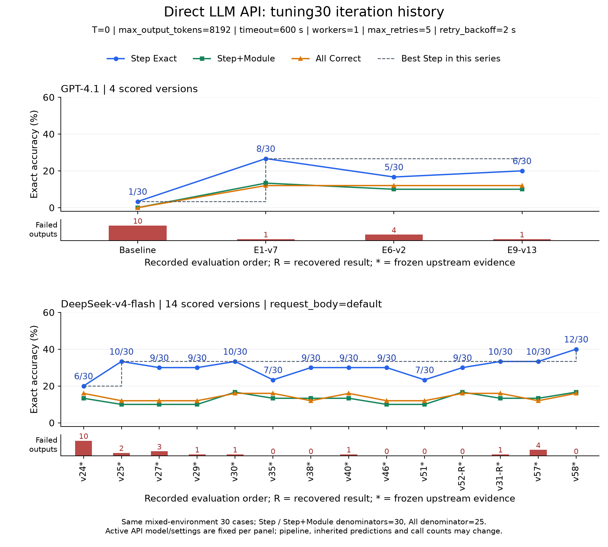
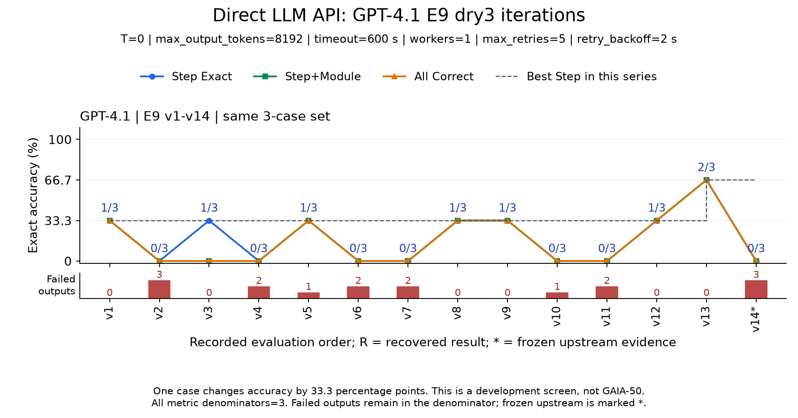
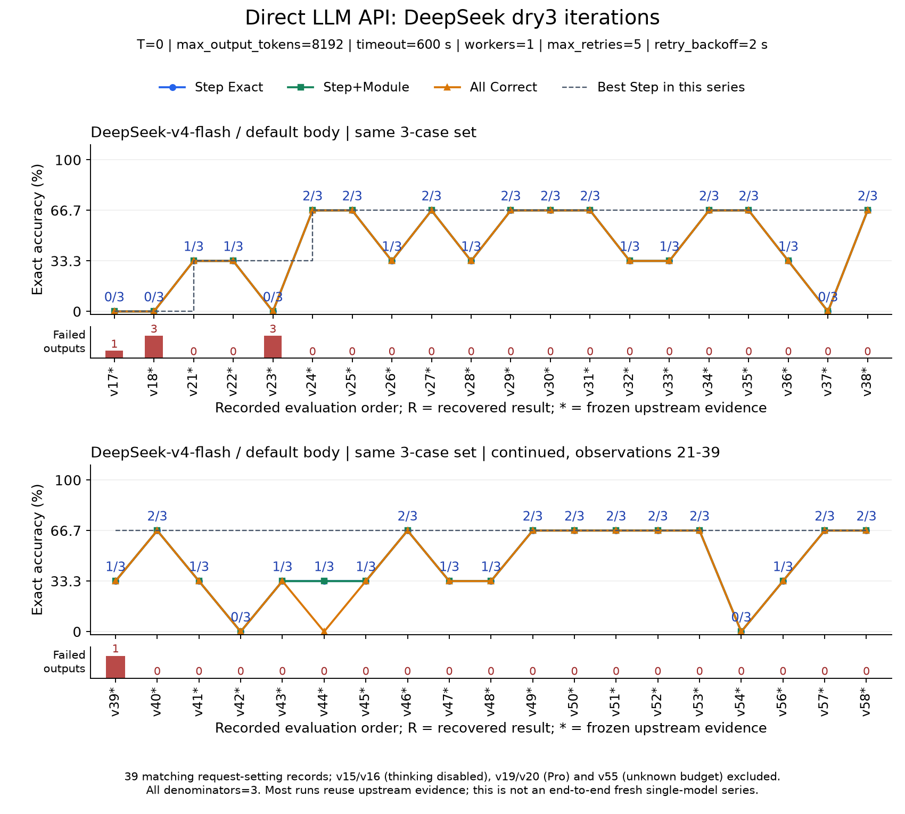
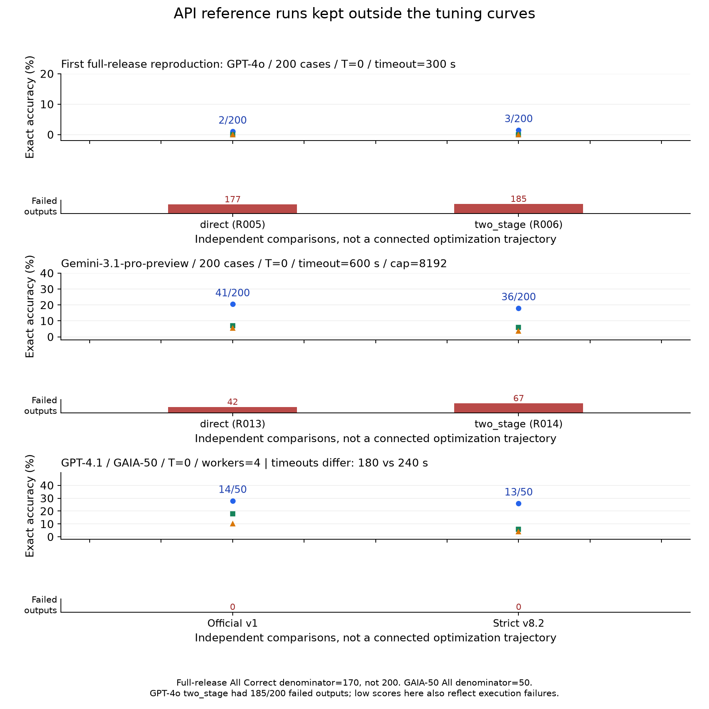

# 直接 LLM API 实验的迭代曲线

这份报告只统计直接 LLM API，不混入 Codex SDK 方法族（包含 SDK/app-server 与宿主
Codex agent/subagent）；见 [统一方法族口径](../method-family-policy.md)。
从 [完整历史档案](../experiment-history-2026-09-05/README.md) 中筛出 **116 条已计分记录**：
GPT-4o 6 条、Gemini-3.1-pro-preview 8 条、GPT-4.1 43 条、DeepSeek-v4-flash 57 条、
DeepSeek-v4-pro 2 条。115 条按历史计分规则可纳入；R223 运行中更改 validator，保留但不进入合法曲线。

## 比较口径

主曲线固定同一实际案例集合与标签数据身份，以及**本轮活动 API 请求的模型和外部参数**：
temperature、token cap、timeout、并发、重试、backoff、已记录的 thinking/request-body 设置。
provider 按此前约定不作筛选条件。26 个外部参数组进一步按已记录的 transport policy、
上游继承方式、活动阶段和方法类别分为 44 个组，在附录逐组展示。

这与固定整个流水线、输入表示、总调用预算不是一回事：这些方法版本本来就改变候选、
选择器、证据处理和调用拓扑。GPT-4.1 早期 transport policy 也有变更，不能把所有分数变化
都归因于诊断提示。缺失参数不是“已知相同”，相同模型 alias 也不等于验证了同一后端快照。

尤其是 DeepSeek 系列：**58 条 API 记录有同 case 冻结上游的明确证据**，已用 `*` 标记；
没有标记不代表已证明全流程 fresh。部分 DeepSeek 方法继承 GPT-4.1 v13 的上游结果，
v57/v58 又复用 v30 incumbent，因此不能写成端到端纯 DeepSeek 的 fresh 优化曲线。
原档案字段不被改写；新报告另存 [运行参数与继承证据摘录](api-runtime-evidence.json)。

所有失败输出保留在原固定分母，按原规则计零。图下方红柱为失败输出数。
纵轴为正确率，蓝色 Step、绿色 Step+Module、橙色 All；标注为 Step 的原始分数。
虚线仅累计同一主曲线的最好 Step，不借用其他模型或数据的最好值。

## 1. 完整 tuning30：两个模型分别看

固定参数：`temperature=0`、`max_output_tokens=8192`、`timeout=600s`、`workers=1`、
`max_retries=5`、`retry_backoff=2s`。DeepSeek 还固定 `request_body_mode=default`。
**tuning30 是三环境混合集合，不是 GAIA-50**。Step 与 Step+Module 分母为 30，All 为 25；
图中按各自真实分母换算百分比，不把 All 错除以 30。



GPT-4.1 四次完整计分：Baseline **1/30** → E1-v7 **8/30** → E6-v2 **5/30** → E9-v13 **6/30**。
失败输出为 10→1→4→1；首次明显提升伴随失败减少，此后更复杂的流水线没有超过 E1-v7。

DeepSeek-v4-flash 的十四次完整计分，按归档评测先后：

| 版本 | Step | Step+Module | All | 失败输出 |
|---|---:|---:|---:|---:|
| v24 | 6/30 | 4/30 | 4/25 | 10 |
| v25 | 10/30 | 3/30 | 3/25 | 2 |
| v27 | 9/30 | 3/30 | 3/25 | 3 |
| v29 | 9/30 | 3/30 | 3/25 | 1 |
| v30 | 10/30 | 5/30 | 4/25 | 1 |
| v35 | 7/30 | 4/30 | 4/25 | 0 |
| v38 | 9/30 | 4/30 | 3/25 | 0 |
| v40 | 9/30 | 4/30 | 4/25 | 1 |
| v46 | 9/30 | 3/30 | 3/25 | 0 |
| v51 | 7/30 | 3/30 | 3/25 | 0 |
| v52 recovery-v2 | 9/30 | 5/30 | 4/25 | 0 |
| v31 recovered | 10/30 | 4/30 | 4/25 | 1 |
| v57 | 10/30 | 4/30 | 3/25 | 4 |
| v58 | 12/30 | 5/30 | 4/25 | 0 |

图中的 `R` 表示恢复后的合法计分，不是一次新的独立全流程运行。
v31 恢复结果在 v52 之后才形成，故没有按版本编号把它人为挪到前面。
最好值为 6→10→12/30，其间大量版本持平或回落；不能说每一步都在提高。

[PDF](01-api-tuning30-by-model.pdf)。

## 2. GPT-4.1 E9：固定 dry3 的十四个版本



v1–v14 全部保留；三项指标的分母均为 3。最好 Step 在 v13 达到 2/3，v14 为 0/3，
但 v14 的三个输出全部失败，而且开始继承冻结 v13，不能把这个下降只解释成诊断能力下降。
较早 E1–E8 使用另一个 dry3 集合，放在附录，不与这条曲线相连。

[PDF](02-gpt41-api-e9-dry3.pdf)。

## 3. DeepSeek-v4-flash / default body：固定 dry3 的三十九个版本



同一模型与请求参数下，v24 首次达到 2/3，之后反复在 0–2/3 之间变化，没有 3/3。
几乎所有观察都基于冻结上游，且活动阶段数会变化。一个案例就对应 **33.3 个百分点**，
不能将小样本的高比例直接当作完整任务效果。

v15/v16 显式禁用 thinking，v19/v20 换成 Pro，v55 的并发/重试配置缺失，均另组保留，
没有混入这条 default-body、明确参数的曲线。

[PDF](03-deepseek-api-default-dry3.pdf)。

## 4. 从首次官方式复现开始，其余 API 结果也没有丢掉



- GPT-4o 全200：direct 2/200、two_stage 3/200；分别有 177、185 个失败输出。
- Gemini 全200：direct 41/200、two_stage 36/200；分别有 42、67 个失败输出。
- GPT-4.1 GAIA-50：官方拓扑 14/50、strict-v8.2 13/50，但 timeout 为 180s/240s，不能当固定配置的连续改善。
- 以上全200的 All 分母为 170；图中仍用各自真实分母。
- v58 的独立 smoke30 为 8/30（All 3/27，失败3）；集合不同，不接在 tuning30 的 12/30 后面。
- hard8、structural10 等诊断中有 7 条 API 记录没有可靠的时间戳，保留独立点，不编造时间线。

[参考图 PDF](04-api-reference-runs.pdf) · [全部116条、44细分组图册](05-all-api-config-groups.pdf) ·
[CSV](api-records.csv) · [JSON](api-records.json) · [核验统计](verification-summary.json)。
未形成正式分数的 API 尝试仍在原档案的 [无分数清单](../experiment-history-2026-09-05/unscored-inventory.csv)，
不把中止实验或部分输出补算成曲线上的 0 分。

## 重绘

```bash
uv run --no-project --with matplotlib python scripts/plot_llm_api_history.py
uv run pytest -q tests/test_llm_api_history.py
```

默认从公开历史 JSON 和已保存的参数摘录重绘；`--refresh-metadata` 才需要本地原始 metrics/preregistration。
不会调用模型、覆盖历史图表、改写原始数据或修改项目锁文件。生成数值与图表有独立的
[哈希清单](figure-manifest.json)，不冒充之前发布快照的新评分。
