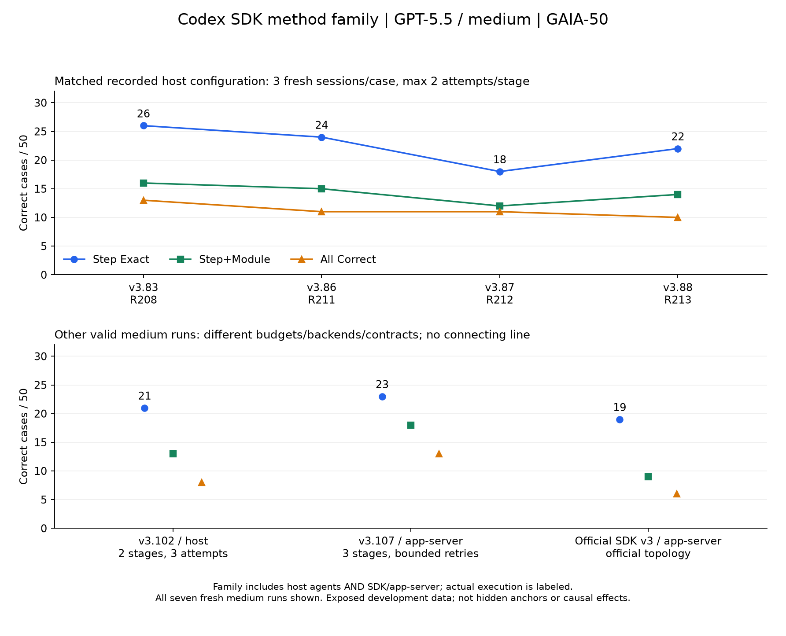

# Experimental evidence — Codex SDK method family

This project groups SDK/app-server and host-orchestrated Codex agents in one method family. Actual backends remain explicit; host runs are not relabeled as SDK-package invocations.

The archive has 214 valid score records from 209 run directories. The Codex SDK family accounts for 99 runs (97 host-agent, 2 app-server). These span models, cohorts and replay modes.

## All fresh GAIA-50 runs with every stage fixed to GPT-5.5 / medium

| ID | Version | Actual backend | Step | Step+Module | All | Recorded configuration |
|---|---|---|---:|---:|---:|---|
| R208 | v3.83 | host-orchestrated Codex agent/subagent | 26/50 | 16/50 | 13/50 | 3 stages; max 2 semantic attempts/stage |
| R211 | v3.86 | host-orchestrated Codex agent/subagent | 24/50 | 15/50 | 11/50 | 3 stages; max 2 semantic attempts/stage |
| R212 | v3.87 | host-orchestrated Codex agent/subagent | 18/50 | 12/50 | 11/50 | 3 stages; max 2 semantic attempts/stage |
| R213 | v3.88 | host-orchestrated Codex agent/subagent | 22/50 | 14/50 | 10/50 | 3 stages; max 2 semantic attempts/stage |
| R215 | v3.102 | host-orchestrated Codex agent/subagent | 21/50 | 13/50 | 8/50 | 2 stages; max 3 attempts/stage |
| R216 | v3.107 | Codex SDK/app-server | 23/50 | 18/50 | 13/50 | app-server 0.147.0; 3 stages; bounded retries |
| R219 | Official SDK v3 | Codex SDK/app-server | 19/50 | 9/50 | 6/50 | app-server 0.147.0; official topology; 1 semantic attempt/call |

The four connected observations share the recorded host configuration: workers=4, three fresh sessions/case, at most two semantic attempts/stage, same 50-case membership. They do not have proven identical host/backend snapshots or realized token costs. Other valid medium runs are shown as separate points. Missing formal results are never zero-filled.

## What the iteration process actually did

A candidate starts from a frozen incumbent, proposes a mechanism, changes code/prompts, checks output contracts, executes a full evaluation, freezes predictions, and then inspects scores/errors. Step Exact determines acceptance; rejected experiments remain in the archive. Many candidates branch from the same incumbent rather than inherit the preceding rejected version.

In the matched GPT-5.5 series, v3.86 tested bounded typed-boundary challenges, v3.87 tested evidence-lifecycle challenges, and v3.88 tested sparse influence-graph challenges. Their Step scores of 24/50, 18/50 and 22/50 did not exceed v3.83's 26/50. v3.107 tested an app-server execution path and bounded transport retries. This is evidence of non-monotonic method search, not proof of a transport effect or of statistical significance.

Luna provides supplementary, separately fixed-model evidence: the stricter 31-version three-stage series improved from 20/50 to 24/50 to 25/50, then 23 further scored versions did not exceed 25/50. It belongs to the same method family but is not GPT-5.5 evidence. The supplementary 31-version Luna figure is included under research/results/fixed-config-history-2026-09-06/ in the packet. It is explicitly a different-model curve; do not pool it with GPT-5.5.

## Audit and interpretation limits

All 50 cases were exposed during development. There is no sealed generalization result, single twelve-hour scratch rollout, or demonstrated non-saturation guarantee. A known source-step mapping anomaly remains in historical full-denominator results. The best observed local number is not external SOTA and has not been reproduced after a standardized app-server port. v3.107 ran before Official SDK v3, so 19→23→26 is not historical chronology.

The CSV contains every valid Codex-family run, including explicitly marked stage replay; it does not claim they are independent full-pipeline iterations. The JSON provides the complete counting rule, source archive SHA-256 and per-record provenance. Ineligible or unscored versions remain in the full research archive, not this valid-run attachment.
